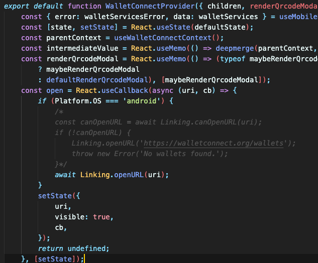

# employeeApp

## 시작하기

- pinata, infura의 이더리움 node, expo, 배포한 contract의 address가 필요합니다.
- 배포는 [여기](https://github.com/somewheregreeny/Blockchain-Management-Employee-Platform/blob/main/employerWeb)를 참조해주세요.

1. `yarn install`로 라이브러리를 설치합니다
2. `employeeApp/contracts/` 경로에 컨트랙트 ABI 파일을 넣습니다. -> ERC20, LaborContract, myNFT, WonToken
3. `.env` 파일에 pinata api key, infura api key, contract의 address, backend endpoint를 설정합니다.
4. `expo start`를 통해 실행합니다.

- `SendAttendanceScreen.tsx`에서 오늘의 날짜와 출근 시간, 퇴근 시간을 수정할 수 있습니다.
- `SendLaborContractScreen.tsx`에서 경력에서 시작할 날짜를 수정할 수 있습니다.

## 추가 사항

만약 안드로이드에서의 walletconnect가 비정상적으로 동작한다면 `yarn install` 후에 다음 조치를 따라주세요.

`node_modules/@walletconnect/react-native-dapp/dist/providers/WalletConnectProvider.js`에서

위와 같이 해당 부분을 주석처리 해주시면 정상 동작합니다.

본격적인 해결방법은 아래를 참조해주세요
https://github.com/celo-org/celo-composer/issues/120

## Screenshot

### 1. 로그인

  
  
  

- 처음 진입하면 메타마스크 지갑을 통해 로그인해야 합니다.
- 로그인을 하고 나면 아무것도 없는 화면이 보입니다.

### 2. 개인 정보 업로드

  
  

- 우선 개인 정보를 등록해야 합니다.
- 이름, 나이, 성별을 적고 메타마스크를 통해 트랜잭션을 보낼 수 있습니다.

### 3. 프로필

  
  

- 개인 정보를 등록 후 프로필에서 위와 같은 정보를 확인할 수 있습니다.

### 4. 개인 정보 업로드

  
  

  
  

- 위에 종 표시를 누르면 알림으로 이동합니다.
- 알림에는 사장님이 보낸 근로계약서 요청이 존재합니다.
- 근로자는 근로계약서를 읽어보고 수락할지 거절할지 결정할 수 있습니다.
- 수락하면 메타마스크를 통해 트랜잭션을 보내게 되고 해당 사업장에 근로자로 등록됩니다.

### 5. 출/퇴근

  
  

  
  
  

- 근로계약서를 등록한 뒤에 내 근무지 메뉴에서 자신의 근무지를 확인할 수 있습니다.
- 근무지가 여러 개 있다면 카드 슬라이드 형식으로 넘길 수 있습니다.
- 출근 또는 퇴근 버튼을 눌러 출/퇴근을 등록할 수 있습니다.
- 출/퇴근시 사업장의 QR코드를 찍게 됩니다.
- 올바른 QR코드라면 출/퇴근 트랜잭션을 보낼 수 있고 올바르지 않다면 거부됩니다.

### 6. 근무지 정보

  

  
  
  

- 근무지 메뉴를 통해 자신의 근무지에 해당하는 근태/급여와 근로계약서를 확인할 수 있습니다.
- 근로계약서 버튼을 누르면 근로계약서를 확인할 수 있습니다.
- 근태/급여 버튼을 누르면 달력을 통해 해당 월의 근태와 급여를 확인할 수 있습니다.

### 7. 나의 보상

  

  
  
  

- 나의 보상 메뉴를 통해 자신이 가지고 있는 NFT 뱃지를 확인할 수 있습니다.
- 뱃지를 누르면 자세한 정보를 볼 수 있습니다.

### 8. 경력, 근로계약서 모두 보기

  

  
  

- 프로필에서 자신의 경력을 볼 수 있습니다.
- 근로계약서 모두 보기 버튼을 누르면 여태껏 근무한 모든 근무지의 근로계약서를 확인할 수 있습니다.

### 9. 토큰 교환

  
  

  
  

- 기존 8만 토큰에 더해 30만 토큰을 지급 받은 상태입니다.
- 슬라이드 바를 통해 원하는 만큼 이더로 환전할 수 있습니다.
- 교환하기 버튼을 누르면 트랜잭션을 보낼 수 있습니다.
- 교환 후 토큰이 줄고 이더가 늘어난 것을 볼 수 있습니다.
